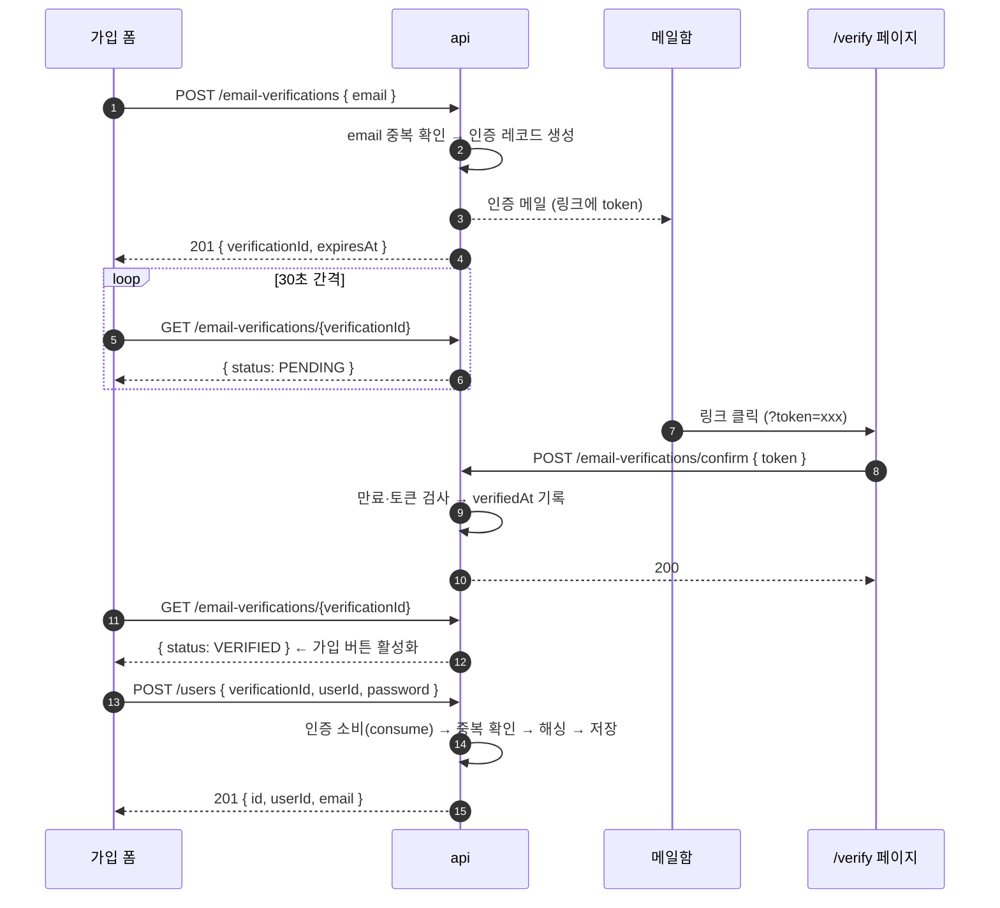
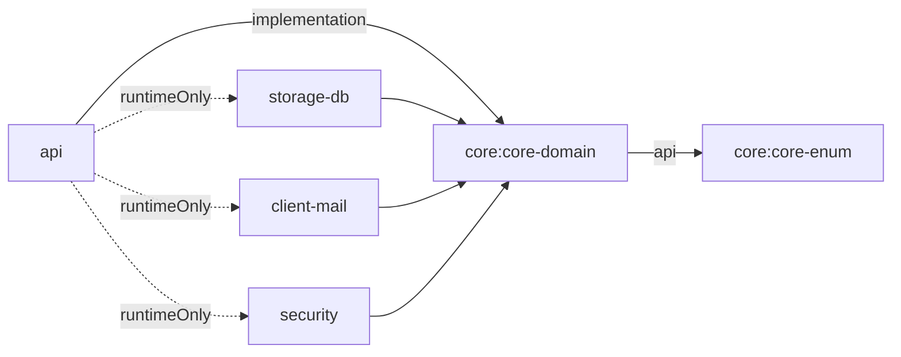

# 회원 도메인 설계

- 최종 갱신: 2026-09-01
- 범위: **회원가입**. 로그인과 회원 정보 조회는 이후 문서에서 다룬다.
- 근거가 되는 결정: [0001](../0001-email-verification-timing.md) ·
  [0002](../0002-email-verification-token-design.md) ·
  [0003](../0003-application-layer-placement.md) ·
  [0004](../0004-infrastructure-adapter-modules.md) ·
  [0005](../0005-uniqueness-and-email-enumeration.md) ·
  [0006](../0006-api-response-contract.md)

## 1. 전체 흐름

이메일을 먼저 인증하고, 인증에 성공한 요청만 가입을 받는다([0001](../0001-email-verification-timing.md)).



식별자가 둘인 이유와 메일 링크가 API 를 직접 치지 않는 이유는
[0002](../0002-email-verification-token-design.md) 에 있다. 요약하면,
`verificationId` 는 폼이 갖고 `token` 은 메일함이 갖는다. **둘 다 가진 주체만 가입할 수 있다.**

## 2. 모듈 배치

```
core:core-enum                UserStatus, EmailVerificationStatus
core:core-domain              도메인 모델 · 값 객체 · 포트 · 도메인 예외
infrastructure:storage-db     JPA 엔티티와 리포지토리 어댑터
infrastructure:client-mail    MailSender 구현 (Resend / SMTP)
infrastructure:security       PasswordEncoder 구현 (bcrypt)
api                           컨트롤러 · DTO · 유스케이스 · 예외 핸들러
```

세 인프라 모듈은 `api` 에서 `runtimeOnly` 로만 참조한다. 빈은 컴포넌트 스캔으로
런타임에 주입된다 — `api` 에서 구현체가 안 보이는 것은 의도다([0004](../0004-infrastructure-adapter-modules.md)).



## 3. 도메인 모델

### 3.1 User

```kotlin
// core-domain: com.example.shopapi.core.domain.user
class User(
    val id: Long?,                  // 서로게이트 PK. 저장 전에는 null
    val userId: UserId,             // 로그인 ID. 유일
    val email: Email,               // 유일
    val password: EncodedPassword,  // bcrypt 해시
    val status: UserStatus,
    val createdAt: Instant,
)
```

`UserStatus` 에 `PENDING` 은 없다. 선인증이므로 **`User` 가 존재하면 이미 인증된 계정**이다.

```kotlin
// core-enum: com.example.shopapi.core.enums
enum class UserStatus { ACTIVE, SUSPENDED, WITHDRAWN }
```

`SUSPENDED` / `WITHDRAWN` 은 지금 쓰이지 않지만, 상태 컬럼 없이 시작하면 나중에
전 계정 마이그레이션이 필요해지므로 처음부터 둔다.

### 3.2 EmailVerification

```kotlin
// core-domain: com.example.shopapi.core.domain.verification
class EmailVerification(
    val id: Long?,
    val verificationId: VerificationId,  // 클라이언트에 노출. 유일
    val token: VerificationToken,        // 메일 링크에만. 유일
    val email: Email,
    val expiresAt: Instant,
    val verifiedAt: Instant?,            // null 이면 미인증
    val consumedAt: Instant?,            // null 이 아니면 가입에 사용 완료
) {
    fun verify(token: VerificationToken, now: Instant): EmailVerification
    fun consume(now: Instant): EmailVerification
    fun statusAt(now: Instant): EmailVerificationStatus
}
```

`verify` 가 거부하는 경우 — 만료됨 / 토큰 불일치 / 이미 소비됨.
이미 인증된 건에는 **멱등하게 성공**한다. 사용자가 링크를 두 번 누르거나 브라우저가
재전송하는 일이 흔하고, 그것을 실패로 보여 줄 이유가 없다.

`consume` 이 요구하는 조건 — 인증 완료 && 미소비 && 미만료.

**`consumedAt` 이 핵심이다.** 없으면 인증 한 번으로 계정을 여러 개 만들 수 있다.

**기한은 둘이다.**

| 기한 | 대상 | 기본값 |
|---|---|---|
| `expiresAt` | 메일 링크. 누르지 않은 채 지나면 만료 | 발급 후 30분 |
| `verifiedAt + CONSUME_TIME_TO_LIVE` | 인증 후 가입까지 | 인증 후 30분 |

하나로 합치면 마감 1분 전에 인증한 사용자에게 가입할 시간이 1분밖에 남지 않는다.
그렇다고 인증 후 무기한으로 두면 소비되지 않은 자격이 계속 살아 있게 된다.

```kotlin
// core-enum
enum class EmailVerificationStatus { PENDING, VERIFIED, EXPIRED, CONSUMED }
```

상태는 컬럼이 아니라 **`verifiedAt` / `consumedAt` / `expiresAt` 과 현재 시각에서 파생**한다.
저장된 상태와 타임스탬프가 어긋날 여지를 없앤다.

### 3.3 값 객체와 검증 규칙

값 객체로 감싸는 이유는 `String` 네 개짜리 생성자에서 `userId` 와 `email` 이 뒤바뀌어도
컴파일러가 잡지 못하기 때문이다. 형식 검증도 한곳에 모인다.

| 값 객체 | 규칙 | 정규화 |
|---|---|---|
| `UserId` | 영문 + 숫자, 4~20자. `^[a-zA-Z0-9]{4,20}$` | **소문자** |
| `Email` | 실용 형식 검증, 최대 254자 | **소문자** |
| `RawPassword` | 8~64자. 영문 1자 이상 **and** 숫자 1자 이상 필수. ASCII 출력 가능 문자만 | 없음 |
| `EncodedPassword` | bcrypt 해시 문자열. 형식 검증만 | 없음 |
| `VerificationId` | UUID | 없음 |
| `VerificationToken` | UUID | 없음 |

정규화를 도메인에서 하는 이유는 [0005](../0005-uniqueness-and-email-enumeration.md) 참고 —
`Alice` 와 `alice` 가 별개 계정이 되면 안 된다.

비밀번호 상한 **64자와 ASCII 제한은 bcrypt 때문**이다. bcrypt 는 입력을 72바이트에서
자른다. 한글을 허용하면 UTF-8 로 글자당 3바이트라 64자가 192바이트가 되어,
**뒷부분이 조용히 버려진다.** 길이가 아니라 바이트 수가 걸리는 문제라
"긴 비밀번호일수록 안전"이라는 직관과 어긋난다.

`RawPassword` 는 절대 로깅되지 않아야 한다. `toString()` 을 마스킹 문자열로 재정의한다.

### 3.4 도메인 예외

```
DuplicateUserIdException          이미 사용 중인 아이디
DuplicateEmailException           이미 가입된 이메일
VerificationNotFoundException     verificationId 로 인증을 찾을 수 없음
VerificationExpiredException      만료됨
VerificationNotCompletedException 아직 인증 전
VerificationAlreadyUsedException  이미 가입에 사용됨
InvalidVerificationTokenException 토큰 불일치
```

`storage-db` 어댑터가 유니크 제약 위반을 잡아 앞의 두 예외로 번역한다.
JPA 예외가 `api` 로 새지 않는다.

## 4. 포트

전부 `core-domain` 의 인터페이스다. 프레임워크 타입이 시그니처에 등장하지 않는다.

```kotlin
interface UserRepository {
    fun save(user: User): User
    fun findByUserId(userId: UserId): User?
    fun existsByUserId(userId: UserId): Boolean
    fun existsByEmail(email: Email): Boolean
}

interface EmailVerificationRepository {
    fun save(verification: EmailVerification): EmailVerification
    fun findByVerificationId(id: VerificationId): EmailVerification?
    fun findByToken(token: VerificationToken): EmailVerification?
    fun deletePendingByEmail(email: Email)   // 재요청 시 기존 미완료 건 정리
}

interface PasswordEncoder {
    fun encode(raw: RawPassword): EncodedPassword
    fun matches(raw: RawPassword, encoded: EncodedPassword): Boolean
}

interface MailSender {
    fun send(mail: Mail)          // Mail: 수신자 · 제목 · 본문(HTML)
}

interface TokenGenerator { fun generate(): String }
interface TimeProvider   { fun now(): Instant }
```

`TimeProvider` 를 포트로 두는 이유는 만료 로직 테스트를 결정적으로 만들기 위해서다.
도메인 안에서 `Instant.now()` 를 부르면 "30분 뒤 만료" 를 테스트할 방법이 없다.

`MailSender` 는 전송 수단에 중립이어야 한다. Resend 의 응답 타입이나 SMTP 세션 개념이
시그니처에 새어 나오면 추상화가 깨진다.

## 5. API

### 5.1 인증 요청

```
POST /api/v1/email-verifications
{ "email": "user@example.com" }

201 { "verificationId": "...", "expiresAt": "2026-09-01T13:30:00Z" }
409 DUPLICATE_EMAIL      이미 가입된 이메일
400 INVALID_REQUEST
```

같은 이메일로 재요청하면 기존 미완료 인증을 정리하고 새로 발급한다.
`409` 로 명확히 알려주는 근거는 [0005](../0005-uniqueness-and-email-enumeration.md) 에 있다.

### 5.2 인증 확인

```
POST /api/v1/email-verifications/confirm
{ "token": "..." }

200
400 INVALID_VERIFICATION_TOKEN
400 VERIFICATION_EXPIRED
409 VERIFICATION_ALREADY_USED
```

메일 링크는 이 API 가 아니라 **프론트엔드 `/verify?token=xxx` 페이지**를 가리키고,
그 페이지가 이 API 를 호출한다. 메일 클라이언트의 링크 프리페치가 사용자 대신
인증을 눌러버리는 것을 막기 위해서다([0002](../0002-email-verification-token-design.md)).

### 5.3 인증 상태 조회 (폴링)

```
GET /api/v1/email-verifications/{verificationId}

200 { "status": "PENDING" | "VERIFIED" | "EXPIRED" | "CONSUMED" }
404 VERIFICATION_NOT_FOUND
```

`token` 은 어떤 경우에도 응답에 담지 않는다.

### 5.4 회원가입

```
POST /api/v1/users
{ "verificationId": "...", "userId": "alice01", "password": "..." }

201 { "id": 1, "userId": "alice01", "email": "user@example.com" }
400 INVALID_REQUEST
400 VERIFICATION_NOT_COMPLETED / VERIFICATION_EXPIRED
404 VERIFICATION_NOT_FOUND
409 DUPLICATE_USER_ID / DUPLICATE_EMAIL / VERIFICATION_ALREADY_USED
```

**요청 본문에 `email` 이 없다.** 이메일은 서버가 `verificationId` 로 조회한 인증
레코드에서 꺼낸다. 바디로 받으면 A 를 인증하고 B 로 가입하는 경로가 열린다.

### 5.5 공통 응답 계약

성공과 실패의 포맷이 다르다. 근거는 [0006](../0006-api-response-contract.md).

**성공 (2xx)** — `application/json`, `ApiResponse<T>` 봉투

```json
{ "data": { "id": 1, "userId": "alice01", "email": "user@example.com" } }
```

**실패 (4xx/5xx)** — `application/problem+json`, RFC 9457 ProblemDetail

```json
{
  "type": "/problems/duplicate-user-id",
  "title": "이미 사용 중인 아이디입니다.",
  "status": 409,
  "detail": "userId 'alice01' 은 이미 사용 중입니다.",
  "instance": "/api/v1/users",
  "code": "DUPLICATE_USER_ID",
  "timestamp": "2026-09-01T04:12:33Z"
}
```

HTTP 상태만으로는 `409` 안의 세 경우를 구분할 수 없다. 확장 필드 `code` 로 나눈다.
검증 실패(`400 INVALID_REQUEST`)는 필드별 사유를 `errors` 확장 필드에 담는다.

```json
{
  "type": "/problems/invalid-request",
  "status": 400,
  "code": "INVALID_REQUEST",
  "errors": [{ "field": "userId", "reason": "영문과 숫자 4~20자여야 합니다." }]
}
```

### 5.6 에러 코드와 상태 코드 매핑

`ErrorCode` 는 `core-enum` 에, HTTP 상태 매핑은 `api` 에 둔다. **`409` 냐 `400` 이냐는
HTTP 의 관심사라 도메인이 알 이유가 없다.**

| ErrorCode | Status | 발생 지점 |
|---|---|---|
| `INVALID_REQUEST` | 400 | 요청 형식 · 값 객체 검증 실패 |
| `VERIFICATION_NOT_COMPLETED` | 400 | 가입 시 인증 미완료 |
| `VERIFICATION_EXPIRED` | 400 | 만료된 인증 |
| `INVALID_VERIFICATION_TOKEN` | 400 | 토큰 불일치 |
| `VERIFICATION_NOT_FOUND` | 404 | verificationId 조회 실패 |
| `DUPLICATE_USER_ID` | 409 | userId 중복 |
| `DUPLICATE_EMAIL` | 409 | email 중복 |
| `VERIFICATION_ALREADY_USED` | 409 | 이미 소비된 인증 |
| `MAIL_SEND_FAILED` | 502 | 메일 게이트웨이 실패 |
| `INTERNAL_ERROR` | 500 | 그 외 |

매핑을 빠뜨리면 조용히 `500` 으로 나가므로 **누락을 잡는 테스트를 둔다**
(`ErrorCode` 전 항목이 매핑표에 있는지 검사).

## 6. 회원가입 유스케이스

`api/user/application/SignUpService` 에 `@Service` + `@Transactional` 로 둔다([0003](../0003-application-layer-placement.md)).

1. DTO → 값 객체 변환 (형식 검증과 정규화가 여기서 일어난다)
2. `verificationId` 로 인증 조회 → 없으면 `VerificationNotFoundException`
3. `verification.consume(now)` → 미인증 / 만료 / 이미 사용됨을 도메인이 판정
4. `userId` 중복 사전 확인 (메시지 품질용)
5. 비밀번호 인코딩
6. `User` 저장 · 소비된 인증 저장 — **여기까지 한 트랜잭션**
7. (가입 완료 안내 메일이 필요해지면) **커밋 이후** 발송

4번의 사전 확인이 중복을 막는 것이 아니다. **유니크 제약이 막고**, 어댑터가 위반을
도메인 예외로 번역한다([0005](../0005-uniqueness-and-email-enumeration.md)).

### 6.1 메일은 커밋 후에, 그러나 동기로 보낸다

인증 요청(`POST /email-verifications`)이 실제로 메일을 보내는 유일한 경로다.
발송 시점을 두고 두 번 판단이 필요했다.

**왜 커밋 후인가** — 트랜잭션 안에서 보내면 이후 롤백되어도 메일은 이미 나가 있다.

**왜 이벤트가 아니라 동기 호출인가** — `@TransactionalEventListener(AFTER_COMMIT)` 로
보내면 발송이 실패해도 사용자는 이미 201 을 받은 뒤다. 오지 않는 메일을 무한정
기다리게 되고, 서버 로그를 보기 전에는 아무도 모른다. 동기로 두면 실패가
`502 MAIL_SEND_FAILED` 로 그대로 보인다.

이를 위해 클래스를 둘로 나눴다.

```
VerificationIssuer        @Transactional   저장만 한다
EmailVerificationService  (트랜잭션 없음)   issuer 호출 후 메일 발송
```

Spring 의 트랜잭션 프록시는 자기 자신을 호출할 때 동작하지 않으므로(self-invocation),
한 클래스 안에서 "커밋 후 발송"을 표현할 수 없다.

발송이 실패하면 인증 레코드는 커밋된 채 남지만 아무도 쓰지 않고 만료되며,
재요청 시 `deleteUnconsumedByEmail` 이 정리한다.

## 7. 영속성

```
users
  id            bigint  PK auto
  user_id       varchar(20)   NOT NULL  UNIQUE
  email         varchar(254)  NOT NULL  UNIQUE
  password      varchar(60)   NOT NULL       -- bcrypt 해시는 60자 고정
  status        varchar(20)   NOT NULL
  created_at    timestamp     NOT NULL

email_verifications
  id               bigint  PK auto
  verification_id  varchar(36)  NOT NULL  UNIQUE
  token            varchar(36)  NOT NULL  UNIQUE
  email            varchar(254) NOT NULL   -- 유일하지 않다. 재요청·재가입 이력이 쌓인다
  expires_at       timestamp    NOT NULL
  verified_at      timestamp    NULL
  consumed_at      timestamp    NULL
  created_at       timestamp    NOT NULL
  INDEX (email, consumed_at)
```

JPA 엔티티는 도메인 모델과 별개 클래스이고, 어댑터가 양방향 매핑을 담당한다.
`core` 는 `jakarta.persistence` 를 알지 못한다(ArchUnit 이 강제).

현재는 H2 인메모리 + `ddl-auto=create-drop` 이다. 실 DB 로 옮길 때
**유니크 제약 위반 예외 번역 코드에 대한 테스트**가 반드시 필요하다 — 드라이버마다
예외 메시지가 다르다.

## 8. 구현 순서

각 단계를 독립 커밋으로 나눈다.

1. `core-enum` + `core-domain` — 값 객체, `User`, `EmailVerification`, 포트, 도메인 예외
   (순수 Kotlin이라 단위 테스트가 프레임워크 없이 돌아간다)
2. `storage-db` — 엔티티, Spring Data 리포지토리, 어댑터, 제약 위반 번역
3. `security` 모듈 신설 — bcrypt `PasswordEncoder` 구현
4. `client-mail` 모듈 신설 — `MailSender` 포트 구현, Resend 어댑터, 프로퍼티 기반 교체
5. `api` — DTO, `SignUpService`, 컨트롤러 2종, 예외 → HTTP 매핑
6. 아키텍처 테스트 갱신 — 신규 모듈 등록, 임시 완화 되돌리기
   (`failOnEmptyShould=true`, `optionalLayer` → `layer`)

## 9. 이번 범위에 넣지 않는 것

- **호출 제한(rate limit)** — 인증 요청 엔드포인트. [0005](../0005-uniqueness-and-email-enumeration.md) 의 열거 완화책이다. 별도 작업.
- **만료 인증 레코드 정리 배치** — 테이블이 무한히 자란다. 운영 전에 필요하다.
- 로그인 / 회원 정보 조회
- 비밀번호 재설정 (인증 토큰 구조를 재사용할 수 있다)
- 탈퇴 회원의 `userId` / `email` 재사용 정책
