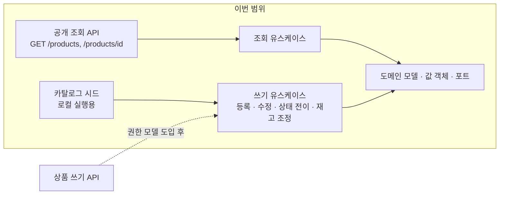
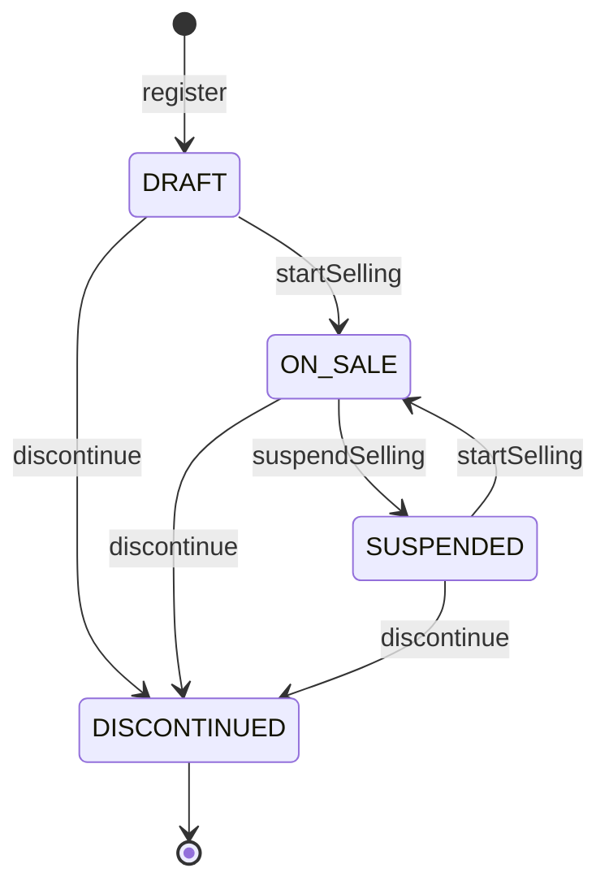

# 상품 도메인 설계

- 최종 갱신: 2026-09-01
- 범위: **상품 카탈로그** — 모델, 재고, 공개 조회.
- 근거가 되는 결정: [0006](../0006-api-response-contract.md) ·
  [0007](../0007-reconstitution-vs-input-validation.md) ·
  [0011](../0011-single-sellable-unit.md) ·
  [0012](../0012-money-representation.md) ·
  [0013](../0013-product-category-as-enum.md) ·
  [0014](../0014-stock-and-oversell.md) ·
  [0015](../0015-product-list-pagination.md)

## 0. 이번 범위의 전제

**관리자와 역할(Role) 개념을 도입하지 않는다.** 이 전제가 아래 두 가지를 결정했다.

- **카테고리를 테이블이 아니라 enum 으로 둔다.** 운영 중에 고칠 주체가 없기 때문이다
  ([0013](../0013-product-category-as-enum.md)).
- **상품 쓰기 API 를 HTTP 로 노출하지 않는다.** 도메인 모델과 유스케이스는 전부 만들되
  컨트롤러를 붙이지 않는다. 이유는 [6장](#6-쓰기-유스케이스와-노출하지-않는-이유)에 적는다.

따라서 이번에 밖으로 나가는 것은 **공개 조회 두 개뿐**이다.



## 1. 모듈 배치

**새 모듈을 만들지 않는다.** 상품은 새로운 바깥 연결(메일 게이트웨이, 암호화 같은)을
요구하지 않으므로 인프라 모듈이 늘어날 이유가 없다
([0004](../0004-infrastructure-adapter-modules.md)). 아키텍처 테스트도 변경이 없다.

```
core:core-enum                ProductCategory, ProductStatus, ProductAvailability, ProductSort
core:core-domain              Product, 값 객체, ProductRepository 포트, 도메인 예외
infrastructure:storage-db     ProductJpaEntity, 어댑터(커서 조회 · 조건부 원자 갱신)
api                           DTO, 커서 인코딩, 유스케이스, ProductController
```

## 2. 도메인 모델

### 2.1 Product

```kotlin
// core-domain: com.example.shopapi.core.domain.product
class Product(
    val id: Long?,                  // 서로게이트 PK. 저장 전에는 null
    val name: ProductName,
    val description: ProductDescription,
    val price: Money,               // 원 단위 정수 (0012)
    val category: ProductCategory,  // enum (0013)
    val stockQuantity: StockQuantity,
    val status: ProductStatus,
    val createdAt: Instant,
    val updatedAt: Instant,
)
```

**공개 식별자를 따로 두지 않는다.** `EmailVerification` 은 `verificationId` 와 `token` 을
나눠 가졌지만([0002](../0002-email-verification-token-design.md)), 그것은 두 주체가
각각 다른 열쇠를 쥐어야 했기 때문이다. 상품에는 감출 것이 없다 — 카탈로그는 공개이고,
id 를 훑어 상품 목록을 얻는 것은 목록 API 가 이미 해 주는 일이다. 순번이 드러나면
"상품이 몇 개인지"가 새지만 그 또한 감출 대상이 아니다.

`id` 를 그대로 쓰면 커서 페이지네이션의 타이브레이커가 공짜로 생긴다
([0015](../0015-product-list-pagination.md)).

**상품명에 유니크 제약을 두지 않는다.** 같은 이름의 다른 상품이 실재한다.
[0005](../0005-uniqueness-and-email-enumeration.md) 가 `userId` 와 `email` 에 제약을 건
것은 그것이 **식별자**이기 때문이고, 상품명은 표시용 이름이다.

### 2.2 상태와 가용성 — 저장하는 것과 파생하는 것

두 개념을 분리한다. 헷갈리기 쉬운 지점이라 이름을 다르게 붙인다.

```kotlin
// core-enum
enum class ProductStatus { DRAFT, ON_SALE, SUSPENDED, DISCONTINUED }   // 저장한다
enum class ProductAvailability { ON_SALE, SOLD_OUT, UNAVAILABLE }      // 파생한다
```

- `ProductStatus` 는 **운영이 정하는 상태**다. 컬럼으로 저장한다.
- `ProductAvailability` 는 **손님에게 보이는 상태**다. 상태와 재고에서 계산한다.

```kotlin
val availability: ProductAvailability
    get() = when {
        status != ProductStatus.ON_SALE -> ProductAvailability.UNAVAILABLE
        stockQuantity.isZero -> ProductAvailability.SOLD_OUT
        else -> ProductAvailability.ON_SALE
    }
```

**품절을 컬럼으로 저장하지 않는 이유**는 [0014](../0014-stock-and-oversell.md) 에 있다.
요약하면, 저장하면 재고 수량과 어긋날 수 있고 어긋났을 때 어느 쪽이 진실인지 알 방법이
없다. `EmailVerification` 이 상태를 타임스탬프에서 파생한 것과 같은 판단이다.

#### 상태 전이



**등록은 `DRAFT` 로 시작한다.** 등록과 판매 개시를 분리해서, 가격이나 재고가 아직
정해지지 않은 상품이 카탈로그에 노출되는 경로를 없앤다.

**`DISCONTINUED` 는 종단이다.** 상태를 **바꾸는** 전이는 모두
`ProductDiscontinuedException` 으로 거절한다. 단종을 다시 요청하는 것만 멱등하게
성공한다 — 목표 상태와 이미 같기 때문이다. 단종을 되돌릴 수 있게 하면 "주문 이력이 참조하는 상품이 다시 팔린다"는 상황이
생기고, 그때 가격과 사양이 예전 주문과 같다는 보장이 없다. 다시 팔려면 새로 등록한다.

**하드 삭제가 없다.** `DISCONTINUED` 가 삭제를 대신한다. 주문 이력이 상품을 참조할
것이므로 행을 지울 수 없다. 주문 도메인이 아직 없지만 지금 지우는 기능을 만들어 두면
나중에 반드시 문제가 된다.

#### 공개 조회에서의 노출 규칙

| 상태 | 목록 | 상세 | 이유 |
|---|---|---|---|
| `DRAFT` | 제외 | `404` | 아직 존재하지 않는 것으로 다룬다 |
| `ON_SALE` | 포함 | `200` | |
| `SUSPENDED` | **제외** | **`200`** (`UNAVAILABLE`) | 아래 참고 |
| `DISCONTINUED` | 제외 | `404` | |

`SUSPENDED` 만 목록과 상세가 갈린다. 목록에서 빼는 이유는 살 수 없는 물건이 진열되면
안 되기 때문이고, 상세를 `200` 으로 주는 이유는 **이미 링크를 가진 사람**(북마크,
공유 링크, 나중에는 주문 내역)이 `404` 를 보면 상품이 없어졌다고 오해하기 때문이다.
"일시적으로 판매하지 않는다"와 "없다"는 다른 사실이다.

### 2.3 값 객체와 검증 규칙

| 값 객체 | 규칙 | 정규화 |
|---|---|---|
| `ProductName` | 1~100자. 제어 문자 금지 | 앞뒤 공백 제거 |
| `ProductDescription` | 0~2000자. 빈 값 허용 | 앞뒤 공백 제거 |
| `Money` | 0 ~ 1,000,000,000 (원 단위 정수) | 없음 |
| `StockQuantity` | 0 ~ 1,000,000 | 없음 |

전부 저장되는 값이므로 팩토리가 둘씩이다 — `of(raw)` 와 `reconstitute(stored)`.
검증은 같고 실패가 `400` 과 `500` 으로 갈린다([0007](../0007-reconstitution-vs-input-validation.md)).

**상품명은 연속 공백을 축약하지 않는다.** `UserId` 와 `Email` 이 소문자로 정규화된 것은
`Alice` 와 `alice` 가 별개 계정이 되는 것을 막기 위해서였다
([0005](../0005-uniqueness-and-email-enumeration.md)). 상품명은 유일성 판단에 쓰이지
않으므로 정규화할 이유가 없고, 오히려 판매자가 의도한 표기를 서버가 바꾸게 된다.

**`Money` 의 상한과 `StockQuantity` 의 상한은 오타 방어**다. 값을 담을 수 없어서가 아니라
`0` 을 하나 더 붙인 입력을 값 객체에서 잡기 위해서다. 상한을 나중에 **좁히면** 이미 저장된
값이 `reconstitute` 에서 걸려 그 상품의 조회가 통째로 `500` 이 된다는 점에 주의한다
([0012](../0012-money-representation.md)).

### 2.4 재고를 다루는 방법

이 절이 이 도메인에서 가장 중요하다. 근거 전문은 [0014](../0014-stock-and-oversell.md).

**`Product` 에 재고를 줄이는 메서드가 없다.** 판정만 있다.

```kotlin
/**
 * 이 수량을 지금 재고로 채울 수 있는가.
 *
 * 표시와 사전 안내용이다. 이 판정을 믿고 차감하면 안 된다 - 동시 요청이 같은 재고를
 * 읽고 모두 통과한다. 실제 차감은 ProductRepository.decreaseStockIfEnough 뿐이다(ADR 0014).
 */
fun canFulfill(quantity: Int): Boolean
```

차감은 포트의 조건부 원자 갱신 하나로만 한다. 도메인에 `decreaseStock` 을 두지 않는
이유는, 두면 반드시 쓰이는데 **단위 테스트에서는 완벽하게 통과하고 운영에서만
초과 판매를 내기 때문**이다.

### 2.5 도메인 예외

```
ProductNotFoundException        상품을 찾을 수 없다(DRAFT / DISCONTINUED 포함)
ProductNotOnSaleException       팔고 있지 않은 상품의 판매를 중지하려 했다
ProductDiscontinuedException    단종된 상품을 고치거나 상태를 바꾸려 했다
```

재고 부족(`OutOfStockException`)을 **지금 만들지 않는다.** 그것을 던질 주체는 주문이고,
`decreaseStockIfEnough` 는 예외가 아니라 `false` 를 돌려주기 때문에 이번 범위에는 던지는
곳이 없다. 부르는 데가 없는 예외와 그에 딸린 에러 코드는 주문 도메인과 함께 넣는다.

## 3. 포트

`core-domain` 의 인터페이스 하나로 끝난다. 시그니처에 프레임워크 타입이 없다.

```kotlin
interface ProductRepository {
    fun save(product: Product): Product

    fun findById(id: Long): Product?

    /** 판매 중인 상품만 돌려준다. 목록의 공개 노출 규칙이 이름에 드러난다 */
    fun findOnSalePage(criteria: ProductSearchCriteria): ProductPage

    /**
     * 재고가 충분할 때만 줄이고, 줄였는지 알려준다.
     *
     * 조회하고 빼서 저장하는 방식으로는 같은 상품에 들어온 동시 주문이 둘 다 통과한다.
     * 둘 다 같은 재고를 읽기 때문이다. 유니크 제약이 중복 가입의 진짜 방어선인 것과
     * 같은 이유로(ADR 0005), 경합은 DB 가 판정한다(ADR 0014).
     *
     * quantity 가 0 이하면 아무것도 바꾸지 않고 false 를 돌려준다. 이 조건도 UPDATE 문
     * 안에 있다 - 어댑터에서 걸러 예외를 던지면 `@Repository` 의 예외 변환이 그것을
     * Spring 의 DAO 예외로 감싸, 어댑터가 프레임워크 타입을 밖으로 흘린다.
     */
    fun decreaseStockIfEnough(id: Long, quantity: Int): Boolean

    /** 주문 취소·환불에 따른 복원. 값 객체의 상한을 우회한다(ADR 0014) */
    fun increaseStock(id: Long, quantity: Int)
}
```

검색 조건과 결과도 `core-domain` 의 순수 타입이다.

```kotlin
data class ProductSearchCriteria(
    val category: ProductCategory?,
    val keyword: String?,
    val sort: ProductSort,
    val cursor: ProductCursor?,
    val size: Int,          // 1~100, 기본 20
)

class ProductCursor(val sort: ProductSort, val price: Money?, val id: Long)

class ProductPage(val items: List<Product>, val nextCursor: ProductCursor?, val hasNext: Boolean)
```

**Spring 의 `Pageable` / `Page` 를 쓰지 않는다.** `core-domain` 은 Spring 에 의존할 수
없고(빌드 설정과 ArchUnit 이 강제), `Pageable` 은 `pageNumber` 라는 offset 개념을 들고
있어 커서 방식과 의미가 맞지도 않는다([0015](../0015-product-list-pagination.md)).

**`size` 에 상한을 둔다.** 열어 두면 한 요청으로 카탈로그 전체를 긁을 수 있고,
페이지네이션이 막으려던 비용이 그대로 발생한다.

## 4. 공개 조회 API

### 4.1 상품 목록

```
GET /api/v1/products?category=FASHION&keyword=셔츠&sort=PRICE_ASC&cursor=...&size=20

200 {
  "data": {
    "items": [
      { "id": 1, "name": "...", "price": 19900, "category": "FASHION",
        "availability": "ON_SALE" }
    ],
    "nextCursor": "UFJJQ0VfQVNDfDE5OTAwfDE",
    "hasNext": true
  }
}
400 INVALID_REQUEST   깨진 커서 / 커서와 sort 불일치 / size 범위 초과
```

- 인증이 필요 없다. `SecurityConfig` 에서 `permitAll` 로 연다.
- **총 개수를 주지 않는다.** 이유는 [0015](../0015-product-list-pagination.md).
- 목록 항목에 `description` 을 담지 않는다. 2000자가 목록마다 실릴 이유가 없다.

**커서 인코딩은 `api` 가 한다.** `ProductCursor` 는 도메인 타입이고, 그것을 base64
문자열로 만들고 되돌리는 것은 HTTP 표현의 관심사다. 깨진 커서는
`InvalidValueException("cursor", ...)` 로 바꿔 나머지 검증 실패와 같은 `400` 으로 낸다.

**커서와 `sort` 가 어긋나면 거절한다.** 커서 안에는 정렬 기준의 값이 들어 있어서,
다른 정렬로 이어 붙이면 결과가 의미를 잃는다. 조용히 이상한 목록을 주는 대신 `400` 을 낸다.

### 4.2 상품 상세

```
GET /api/v1/products/{id}

200 { "data": { "id": 1, "name": "...", "description": "...", "price": 19900,
                "category": "FASHION", "availability": "ON_SALE",
                "stockQuantity": 12 } }
404 PRODUCT_NOT_FOUND
```

`DRAFT` 와 `DISCONTINUED` 는 `404` 다([2.2](#공개-조회에서의-노출-규칙)).

**재고 수량을 그대로 노출한다.** 커머스에서 "품절 임박" 표시에 쓰이는 값이고, 감춰서
얻는 것이 없다. 정확한 수량을 숨기고 싶어지면 그때 구간(`10개 미만`)으로 바꾼다 —
값 하나를 좁히는 것이므로 계약 변경이 작다.

### 4.3 에러 코드와 상태 코드 매핑

`ErrorCode`(core-enum)와 `ErrorCodeHttpStatus`(api) **양쪽에 추가**한다.
매핑을 빠뜨리면 조용히 `500` 으로 나가고, `ErrorCodeHttpStatusTest` 가 그것을 잡는다.

| ErrorCode | Status | 발생 지점 |
|---|---|---|
| `PRODUCT_NOT_FOUND` | 404 | 상세 조회, 존재하지 않거나 비공개 상태 |
| `PRODUCT_NOT_ON_SALE` | 409 | 팔고 있지 않은 상품의 판매 중지 시도 |
| `PRODUCT_DISCONTINUED` | 409 | 단종 상품의 수정·상태 전이 시도 |

## 5. 조회 유스케이스

`api/product/application/ProductQueryService` 에 `@Transactional(readOnly = true)` 로
둔다([0003](../0003-application-layer-placement.md)).

하는 일은 **공개 노출 규칙을 적용하는 것 하나**다. 목록은 `ON_SALE` 만 조회하고,
상세는 조회 후 `DRAFT` / `DISCONTINUED` 를 `ProductNotFoundException` 으로 바꾼다.

이 판정을 컨트롤러에 두지 않는다. 컨트롤러는 DTO 변환과 HTTP 관심사만 맡는다.

## 6. 쓰기 유스케이스와, 노출하지 않는 이유

`api/product/application` 에 둔다. 컨트롤러는 붙이지 않는다.

```
ProductRegistrationService   register            DRAFT 로 등록
ProductManagementService     changeDetails       이름 · 설명 · 카테고리
                             changePrice
                             startSelling        DRAFT/SUSPENDED -> ON_SALE
                             suspendSelling      ON_SALE -> SUSPENDED
                             discontinue         -> DISCONTINUED (종단)
                             adjustStock         재고 정정 (입고 · 실사)
```

**왜 HTTP 로 열지 않는가**

권한 모델이 없기 때문이다. 지금 열 수 있는 선택지는 두 개뿐이고 둘 다 나쁘다.

- **인증 없이 연다** — 아무나 카탈로그를 고친다. 논외다.
- **`authenticated()` 로만 막는다** — 로그인한 아무 회원이나 모든 상품의 가격과 재고를
  고칠 수 있다. **인증은 인가가 아니다.** 게다가 이 상태는 "일단 막아 뒀다"처럼 보여서,
  실제로는 열려 있다는 사실이 눈에 띄지 않는다. 가장 위험한 형태다.

그래서 열지 않는다. 도메인 규칙과 상태 전이는 지금 확정하고 단위 테스트로 검증하되,
**"누가 할 수 있는가"가 정해질 때 컨트롤러만 얹는다.** 유스케이스 시그니처는 그때
바뀌지 않는다.

**그러면 지금 카탈로그는 누가 채우는가**

로컬 실행용 시드가 채운다. H2 인메모리에 `ddl-auto=create-drop` 이라 재시작마다
비기 때문에, 조회 API 를 실제로 확인하려면 어차피 무언가 필요하다.

```
catalog.seed=true    애플리케이션 기동 시 샘플 상품을 등록한다. application.properties 의 기본값
```

목록 결과를 재는 테스트는 이것을 끈다. 시드가 들어오면 테스트가 만든 상품과 섞여
실행 순서에 따라 답이 달라진다.

시드는 유스케이스를 호출한다. 직접 리포지토리를 부르지 않는다 — 그러면 도메인 규칙을
우회한 데이터가 들어가고, 시드로 만든 상품만 조회에서 이상하게 동작하는 일이 생긴다.

## 7. 영속성

```
products
  id             bigint        PK auto
  name           varchar(100)  NOT NULL
  description    varchar(2000) NOT NULL     -- 빈 문자열 허용, NULL 은 쓰지 않는다
  price          bigint        NOT NULL     -- 원 단위 정수 (0012)
  category       varchar(40)   NOT NULL     -- enum 이름 (0013)
  stock_quantity int           NOT NULL
  status         varchar(20)   NOT NULL
  created_at     timestamp     NOT NULL
  updated_at     timestamp     NOT NULL
```

**유니크 제약이 없다.** 상품명은 식별자가 아니다([2.1](#21-product)).

**`description` 에 `NULL` 을 쓰지 않는다.** "설명이 없다"와 "설명이 빈 문자열이다"를
구분할 이유가 없는데, 구분되는 순간 모든 조회 코드가 두 경우를 다뤄야 한다.

### 인덱스

커서 페이지네이션은 인덱스와 정확히 맞물릴 때만 이점이 있다. 정렬 기준마다 필요하다.

```
idx_products_status_id           (status, id DESC)                  전체 · 최신순
idx_products_status_cat_id       (status, category, id DESC)        카테고리 · 최신순
idx_products_status_price_id     (status, price, id)                전체 · 가격순
idx_products_status_cat_price_id (status, category, price, id)      카테고리 · 가격순
```

`PRICE_DESC` 는 가격순 인덱스를 역방향으로 스캔한다.

인덱스가 넷인 것이 **필터 × 정렬 조합만큼 인덱스가 필요하다는 비용**을 그대로 보여준다.
정렬 옵션을 하나 더 넣으면 둘이 는다. 정렬을 무제한으로 늘릴 수 없다는 뜻이다.

### 알아 둘 함정 둘

**`keyword` 는 인덱스를 타지 못한다.** `LIKE '%셔츠%'` 는 앞이 열려 있어 전체 스캔이다.
카탈로그가 작은 동안만 유효하고, 검색이 실제 기능이 되면 전문 검색으로 옮겨야 한다.
모른 채 상품이 늘면 목록 API 가 서서히 느려지고 원인을 페이지네이션으로 오해하기 쉽다
([0015](../0015-product-list-pagination.md)).

재고를 바꾸는 두 쿼리는 `updated_at` 을 건드리지 않는다. 그 값은 카탈로그를 고친
시각이고 재고 차감은 카탈로그 수정이 아니다. 시각을 받게 만들면 포트 시그니처에 시계가
끌려 들어온다.

**재고 차감의 벌크 `UPDATE` 는 영속성 컨텍스트를 우회한다.** 같은 트랜잭션에서 차감 전에
읽어 둔 `ProductJpaEntity` 는 낡은 재고를 들고 있고, 그 상태로 다른 필드를 저장하면
차감이 되돌아간다. `@Modifying(clearAutomatically = true, flushAutomatically = true)` 를
쓰거나 차감 뒤에는 그 엔티티를 다시 쓰지 않는다([0014](../0014-stock-and-oversell.md)).

## 8. 구현

아래 순서로 만들었고 전부 들어가 있다.

1. `core-enum` — `ProductCategory`, `ProductStatus`, `ProductAvailability`, `ProductSort`,
   `ErrorCode` 4개 추가
2. `core-domain` — `Money`, `ProductName`, `ProductDescription`, `StockQuantity`,
   `Product`, 도메인 예외, `ProductRepository` 와 검색 타입
   (순수 Kotlin 이라 상태 전이와 가용성 파생을 프레임워크 없이 테스트한다)
3. `storage-db` — 엔티티, Spring Data 리포지토리, 어댑터.
   **커서 조건 쿼리와 조건부 원자 갱신이 이 단계의 핵심**이고, 동시 차감 테스트를 함께 넣는다
4. `api` — `ErrorCodeHttpStatus` 매핑, 커서 인코딩, DTO, `ProductQueryService`,
   `ProductController`, `SecurityConfig` 에 공개 경로 추가
5. 쓰기 유스케이스와 카탈로그 시드
6. `tests:api-docs` — 목록·상세 문서화

2번과 3번 사이에서 한 번 멈추고 볼 것이 있었다. **재고 차감 테스트가 실제로 동시성을
재고 있는가.** 단일 스레드로 두 번 부르는 테스트는 조회 후 차감 방식에서도 통과한다.
`ProductStockConcurrencyTest` 가 스레드를 실제로 겹쳐서 재고 1 에 20개의 요청을 던진다.

## 9. 이번 범위에 넣지 않는 것

- **상품 옵션과 변형(SKU)** — [0011](../0011-single-sellable-unit.md).
  주문 도메인 설계 직전이 재검토 시점이다
- **상품 쓰기 HTTP API** — 역할·권한 모델이 정해진 뒤([6장](#6-쓰기-유스케이스와-노출하지-않는-이유))
- **재고 예약(reserve / confirm / release)** — 주문 도메인과 함께.
  지금은 차감과 복원만 있다
- **재고 이력과 입출고 관리** — [0014](../0014-stock-and-oversell.md)
- 상품 이미지, 리뷰와 평점
- 할인·쿠폰 — 나눗셈과 반올림 정책이 필요하다([0012](../0012-money-representation.md))
- 전문 검색 — [0015](../0015-product-list-pagination.md)
- 카테고리 관리 API — [0013](../0013-product-category-as-enum.md)
